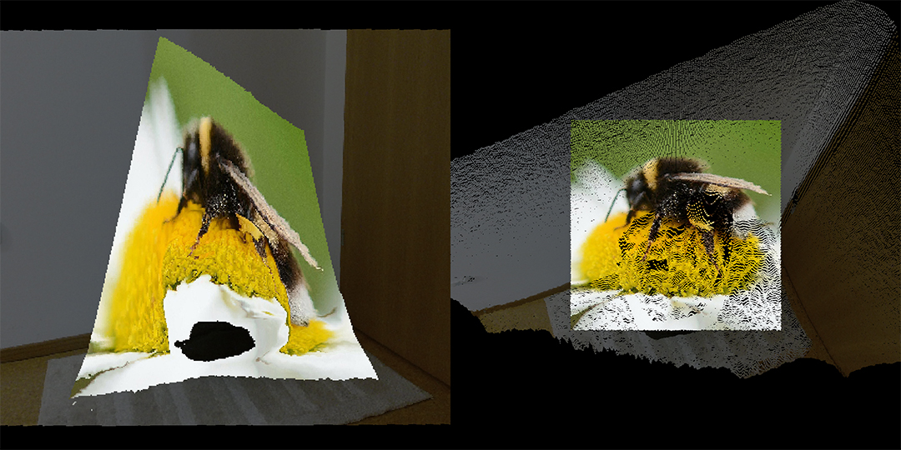
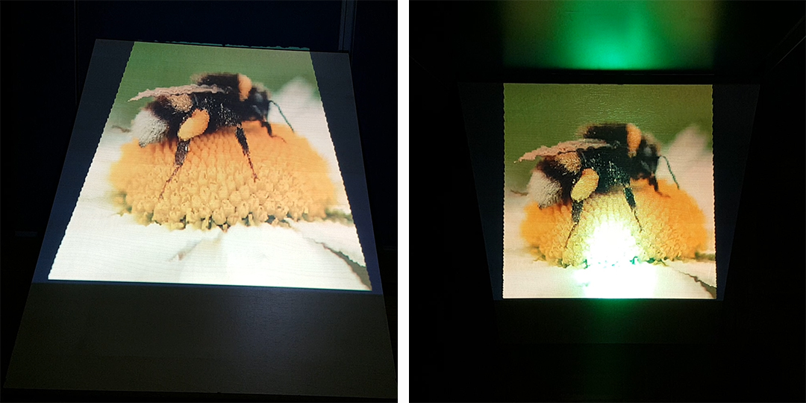

# Video Anamorphosis

> Anamorphosis is a distorted projection requiring the viewer to occupy a specific vantage point to view a recognizable image.

The goal of this project is to project an image or video onto any surface in such a way that it looks perfect when viewed from a specific angle. The final report is available [here](docs/video-anamorphosis.pdf).

## Results

The following images show the projector point-of-view (left) and the observer point-of-view (right).

* Virtual anamorphosis on a point cloud
	

* Real-life anamorphosis on a wooden board
	

## Dependencies

| Dependency | Version | Description             |
|------------|--------:|-------------------------|
| GLFW       | 3.3     | OpenGL context creation |
| GLEW       | 2.1.0   | OpenGL extension loader |
| GLM        | 0.9.9.6 | OpenGL math library     |
| Kinect SDK | 2.0     | Windows Kinect API      |
| stb_image  | 2.23    | Image loading library   |
| FFmpeg     | 4.2.1   | Video loading library   |

## Controls

| Key          | Function                                                 |
|--------------|----------------------------------------------------------|
| R            | Toggle depth recording                                   |
| V            | Switch between video and image mode                      |
| D            | Toggle debug mode                                        |
| O            | Project colour data back onto objects                    |
| S            | Save depth data as `depth.bmp`                           |
| Up, Down     | [**Debug mode**] Rotate view horizontally                |
| Left, Right  | [**Debug mode**] Move view vertically                    |
| +, -         | [**Debug mode**] Resize projection                       |
| Scroll wheel | [**Debug mode**] Change projection radius                |
| W            | [**Debug mode**] Toggle wireframe mode                   |
| M            | [**Debug mode**] Toggle missing data approximation       |
| C            | [**Debug mode**] Toggle calibration mode                 |
| K            | [**Debug mode**] Switch between point mapping modes      |
| Space        | [**Debug mode**] Toggle between live view and projection |
| Enter        | [**Debug mode**] Apply projection to current position    |
| 1            | [**Debug mode**] Move camera to projector view           |
| 2            | [**Debug mode**] Move camera to observer view            |
| Esc          | Exit                                                     |

## How to use

1. Install dependencies
2. Connect an Xbox One Kinect and a projector (set as secondary monitor) to your computer
3. Adjust the following parameters at the top of the `main.cpp` as necessary:
	* Anamorphic angle, radius and field of view
	* Image and video file paths
	* Projector resolution and field of view
4. Compile and run
5. Use calibration mode to align kinect and projector
6. Done!

